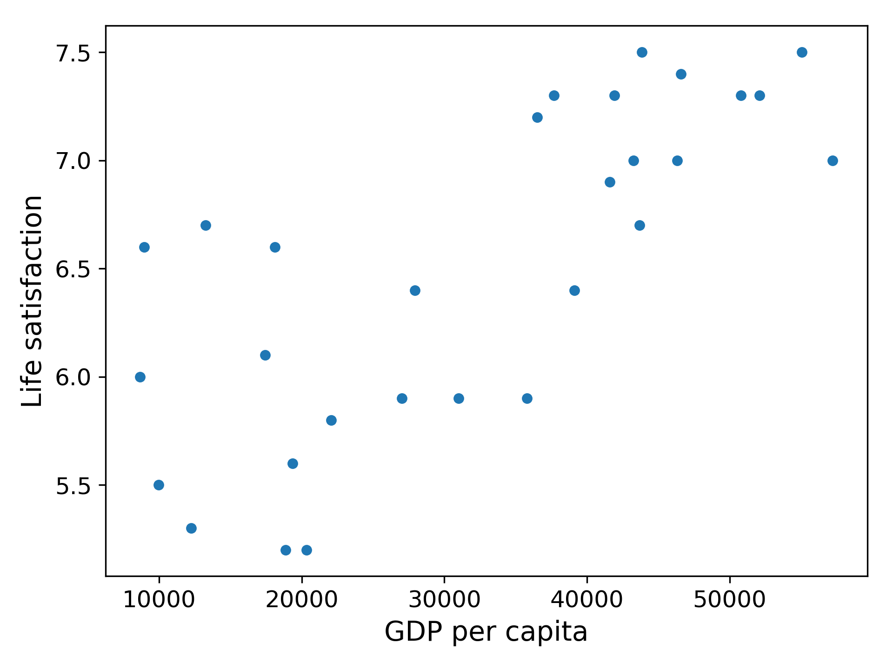
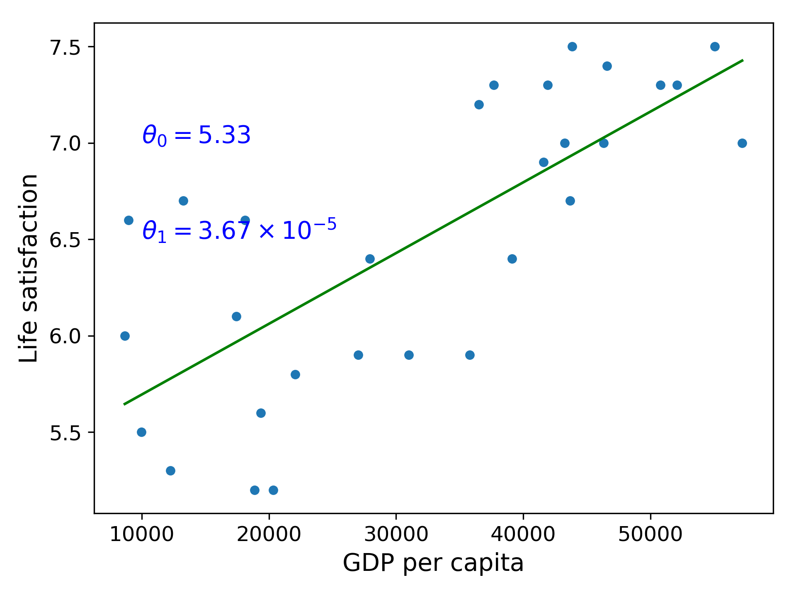

# Find relation between money and life satisfaction

- Due to limited life index data, we can use this model to predict life satisfaction which we want but miss, such as Cyprus.

#### origin data plot
<!--  -->

#### regression data plot
<!--  -->

------
## Data 

- [Better Life Index - Edition 2017](http://stats.oecd.org/index.aspx?DataSetCode=BLI)

- [Gross domestic product(GDP)](http://www.imf.org/external/pubs/ft/weo/2016/01/weodata/weorept.aspx?pr.x=32&pr.y=8&sy=2015&ey=2015&scsm=1&ssd=1&sort=country&ds=.&br=1&c=512%2C668%2C914%2C672%2C612%2C946%2C614%2C137%2C311%2C962%2C213%2C674%2C911%2C676%2C193%2C548%2C122%2C556%2C912%2C678%2C313%2C181%2C419%2C867%2C513%2C682%2C316%2C684%2C913%2C273%2C124%2C868%2C339%2C921%2C638%2C948%2C514%2C943%2C218%2C686%2C963%2C688%2C616%2C518%2C223%2C728%2C516%2C558%2C918%2C138%2C748%2C196%2C618%2C278%2C624%2C692%2C522%2C694%2C622%2C142%2C156%2C449%2C626%2C564%2C628%2C565%2C228%2C283%2C924%2C853%2C233%2C288%2C632%2C293%2C636%2C566%2C634%2C964%2C238%2C182%2C662%2C453%2C960%2C968%2C423%2C922%2C935%2C714%2C128%2C862%2C611%2C135%2C321%2C716%2C243%2C456%2C248%2C722%2C469%2C942%2C253%2C718%2C642%2C724%2C643%2C576%2C939%2C936%2C644%2C961%2C819%2C813%2C172%2C199%2C132%2C733%2C646%2C184%2C648%2C524%2C915%2C361%2C134%2C362%2C652%2C364%2C174%2C732%2C328%2C366%2C258%2C734%2C656%2C144%2C654%2C146%2C336%2C463%2C263%2C528%2C268%2C923%2C532%2C738%2C944%2C578%2C176%2C537%2C534%2C742%2C536%2C866%2C429%2C369%2C433%2C744%2C178%2C186%2C436%2C925%2C136%2C869%2C343%2C746%2C158%2C926%2C439%2C466%2C916%2C112%2C664%2C111%2C826%2C298%2C542%2C927%2C967%2C846%2C443%2C299%2C917%2C582%2C544%2C474%2C941%2C754%2C446%2C698%2C666&s=NGDPDPC&grp=0&a=#cs189) 

### Data description

    Int64Index: 3292 entries, 0 to 3291
    Data columns (total 17 columns):
    "LOCATION"              3292 non-null object
    Country                  3292 non-null object
    INDICATOR                3292 non-null object
    Indicator                3292 non-null object
    MEASURE                  3292 non-null object
    Measure                  3292 non-null object
    INEQUALITY               3292 non-null object
    Inequality               3292 non-null object
    Unit Code                3292 non-null object
    Unit                     3292 non-null object
    PowerCode Code           3292 non-null int64
    PowerCode                3292 non-null object
    Reference Period Code    0 non-null float64
    Reference Period         0 non-null float64
    Value                    3292 non-null float64
    Flag Codes               1120 non-null object
    Flags                    1120 non-null object
    dtypes: float64(3), int64(1), object(13)
    memory usage: 462.9+ KB

### Example usage using python Pandas

    >>> life_sat = pd.read_csv("oecd_bli_2015.csv", thousands=',')
    
    >>> life_sat_total = life_sat[life_sat["INEQUALITY"]=="TOT"]
    
    >>> life_sat_total = life_sat_total.pivot(index="Country", columns="Indicator", values="Value")
    
    >>> life_sat_total.info()
    <class 'pandas.core.frame.DataFrame'>
    Index: 37 entries, Australia to United States
    Data columns (total 24 columns):
    Air pollution                                37 non-null float64
    Assault rate                                 37 non-null float64
    Consultation on rule-making                  37 non-null float64
    Dwellings without basic facilities           37 non-null float64
    Educational attainment                       37 non-null float64
    Employees working very long hours            37 non-null float64
    Employment rate                              37 non-null float64
    Homicide rate                                37 non-null float64
    Household net adjusted disposable income     37 non-null float64
    Household net financial wealth               37 non-null float64
    Housing expenditure                          37 non-null float64
    Job security                                 37 non-null float64
    Life expectancy                              37 non-null float64
    Life satisfaction                            37 non-null float64
    Long-term unemployment rate                  37 non-null float64
    Personal earnings                            37 non-null float64
    Quality of support network                   37 non-null float64
    Rooms per person                             37 non-null float64
    Self-reported health                         37 non-null float64
    Student skills                               37 non-null float64
    Time devoted to leisure and personal care    37 non-null float64
    Voter turnout                                37 non-null float64
    Water quality                                37 non-null float64
    Years in education                           37 non-null float64
    dtypes: float64(24)
    memory usage: 7.2+ KB

## GDP per capita
### Source
Dataset obtained from the IMF's website at: http://goo.gl/j1MSKe

### Data description

    Int64Index: 190 entries, 0 to 189
    Data columns (total 7 columns):
    Country                          190 non-null object
    Subject Descriptor               189 non-null object
    Units                            189 non-null object
    Scale                            189 non-null object
    Country/Series-specific Notes    188 non-null object
    2015                             187 non-null float64
    Estimates Start After            188 non-null float64
    dtypes: float64(2), object(5)
    memory usage: 11.9+ KB

### Example usage using python Pandas

    >>> gdp_per_capita = pd.read_csv(
    ...     datapath+"gdp_per_capita.csv", thousands=',', delimiter='\t',
    ...     encoding='latin1', na_values="n/a", index_col="Country")
    ...
    >>> gdp_per_capita.rename(columns={"2015": "GDP per capita"}, inplace=True)